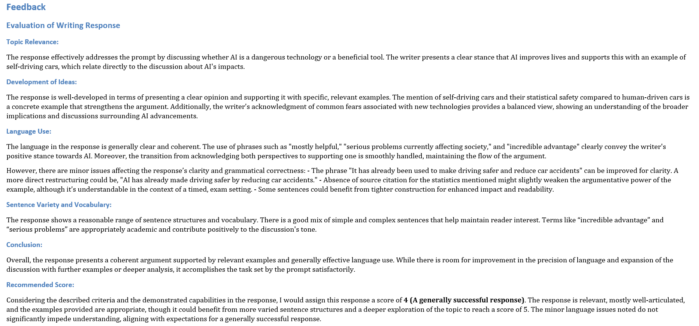

# IELTS & TOEFL GPT

## Updates🎉!

1. Add support for evaluating TOEFL writing tasks;
2. Optimize prompt templates for better evaluation.

## Usage

Use **minimum** dependencies to launch powerful GPT4 to evaluate your IELTS/TOFEL writing tasks and give detailed feedback considering different criteria.

### IELTS Writing Task Ⅱ

1. edit `data/essay.txt` with your own writing script according to the given format in `ielts_essay_demo.txt`.
2. run with `python ieltsGPT.py` to obtain `data/feedback.md`.

### TOEFL Writing Task Ⅰ ＆ Ⅱ

1. edit `data/essay.txt` with your own writing script according to the given format in `toefl_essay_demo.txt`.
2. run with `python toeflGPT.py --task 1` for **Integrated Writing** task (`--task 2` for **Writing for an Academic Discussion** task) to obtain `data/feedback.md`.

(Optional: click `md2doc.bat` to convert `feedback.md` into `feedback.docx`)

Give a Star if it helps 🤗.

## Demos

### IELTS

### TOEFL

