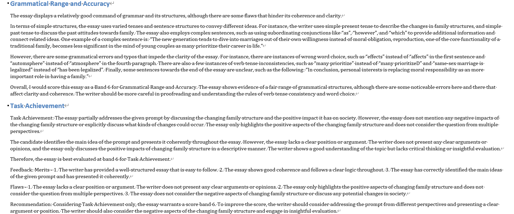
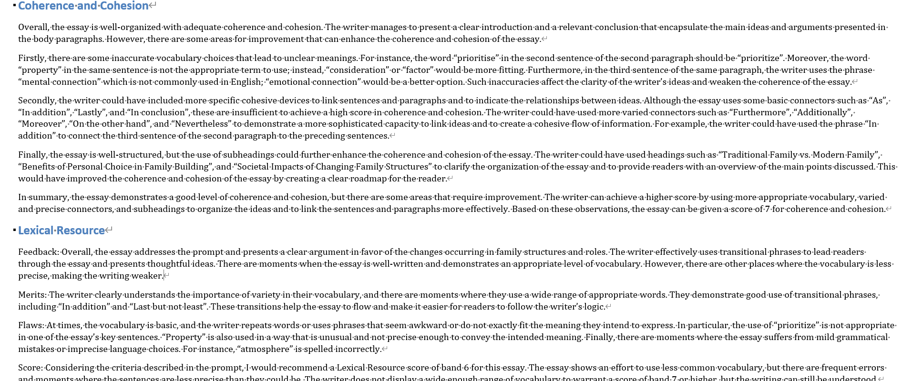

# ieltsGPT

===========================

## Usage

Use **minimum** dependencies to launch powerful ChatGPT to evaluate your IELTS writing task 2 and give detailed feedback.

1. clone the repository `git clone https://github.com/stupidHIGH/ParlAI.git `

2. replace `ielts_essay.txt` with your own writing script (use the given format).

3. run with `python ieltsGPT.py` to generate `ielts_feedback.md`

   (Optional: click `md2doc.bat` to convert `ielts_feedback.md` into `ielts_feedback.docx`)

## Demo

Give a Star is it helps:blush:.
